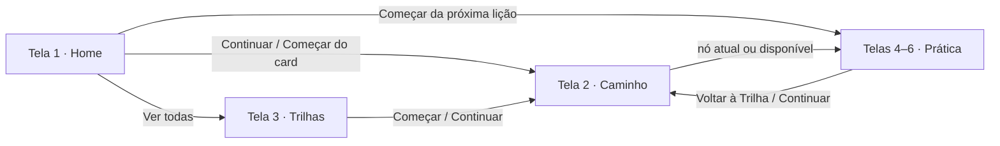

# Design system e estrutura das telas — Unipar Trail Code (FE-002)

Este documento descreve a implementação do ticket **FE-002 — Implementar o design system e os componentes visuais compartilhados** e a estrutura das telas que já possuem wireframe (`1.png` a `7.png` do kit *Unipar Trail Code*).

## 1. Conceito

A primeira versão entregava os componentes em uma única página de catálogo, que misturava partes de todas as telas. Isso não representava como o app é navegado. Na versão atual:

- **cada wireframe virou uma página própria**, no módulo de negócio a que pertence;
- as páginas são **montadas com os componentes do design system**, sem repetir estilo;
- uma **navegação do aluno** liga as páginas exatamente como nos wireframes (navegação inferior com quatro abas);
- o catálogo foi removido e substituído por uma **pré-visualização do app real** (`lib/main_preview.dart`).

### 1.1 Camadas

```text
┌──────────────────────────────────────────────────────────────┐
│ Entradas            main.dart (app)  ·  main_preview.dart    │
├──────────────────────────────────────────────────────────────┤
│ Navegação           modules/home/page/aluno_navegacao_page   │
├──────────────────────────────────────────────────────────────┤
│ Telas               modules/<módulo>/page/*_page.dart        │
│ Partes de uma tela  modules/<módulo>/widgets/                │
│ Dados da tela       modules/<módulo>/models/                 │
├──────────────────────────────────────────────────────────────┤
│ Compartilhado       shared/widgets (AlunoHeader…)            │
│ entre módulos       shared/models  (AlunoResumo)             │
├──────────────────────────────────────────────────────────────┤
│ Design system       core/widgets (AppPage, TrailCard…)       │
│                     core/theme   (tokens, ThemeData, ativos) │
└──────────────────────────────────────────────────────────────┘
```

Regras de dependência:

| Camada | Pode importar | Não pode importar |
|---|---|---|
| `core/theme`, `core/widgets` | apenas Flutter e `core` | `modules`, `shared` |
| `shared/` | `core` | `modules` (exceto `shared/preview`) |
| `modules/<m>/widgets`, `models` | `core`, `shared`, modelos de outro módulo quando a tela os exibe | páginas de outros módulos |
| `modules/<m>/page` | tudo acima | — |
| `AlunoNavegacaoPage` | páginas de todos os módulos do aluno | — |

Onde colocar algo novo:

- é visual e genérico (botão, card, barra)? → `core/widgets`;
- aparece em telas de módulos diferentes (cabeçalho do aluno)? → `shared/widgets`;
- só existe em uma tela (meta diária, mapa de lições)? → `modules/<módulo>/widgets`;
- é a tela inteira de um wireframe? → `modules/<módulo>/page`.

## 2. Mapa wireframe → tela

| Wireframe | Tela | Página | Módulo | Aba ativa |
|---|---|---|---|---|
| `1.png` | Home do aluno | `AlunoHomePage` | `home` | Início |
| `2.png` | Caminho da trilha | `CaminhoTrilhaPage` | `aprendizagem` | Trilhas |
| `3.png` | Trilhas de Aprendizado | `CatalogoAlunoPage` | `catalogo_aluno` | Trilhas |
| `4.png` | Questão com alternativa selecionada | `PraticaPage` (estado inicial) | `aprendizagem` | Trilhas |
| `5.png` | Resposta incorreta | `PraticaPage` (correção incorreta) | `aprendizagem` | Trilhas |
| `6.png` | Resposta correta | `PraticaPage` (correção correta) | `aprendizagem` | Trilhas |
| `7.png` | Perfil / visão geral | `PerfilPage` | `perfil` | Perfil (ícone de menu) |

As telas 4, 5 e 6 são **a mesma página em estados diferentes**, não três páginas.

## 3. Navegação

`AlunoNavegacaoPage` usa `AppShell` com a navegação inferior e um `IndexedStack` que preserva o estado de cada aba.

| Aba | Ícone | Conteúdo |
|---|---|---|
| Início | casa | tela 1 |
| Desempenho | barras | sem wireframe: estado vazio “Em breve…” |
| Trilhas | livro | pilha própria: tela 3 → tela 2 → telas 4–6 |
| Perfil | menu | tela 7 |



Comportamentos:

- a aba Trilhas tem um `Navigator` interno, por isso a navegação inferior continua visível no caminho e na prática, como nos wireframes;
- ações da home que abrem uma trilha trocam para a aba Trilhas e empilham as telas nela;
- tocar na aba Trilhas já ativa volta ao catálogo;
- o botão voltar do sistema desempilha a aba Trilhas, depois retorna à aba Início e só então sai do app;
- lições bloqueadas não abrem a prática.

A navegação usa somente `Navigator`/`MaterialPageRoute`, conforme o plano (sem GoRouter/Riverpod).

## 4. Estrutura de cada tela

### Tela 1 — `AlunoHomePage` (refinada com medidas do wireframe)

```text
AppPage (margens definidas por bloco)
├── AlunoHeader                  (shared) avatar · nome · RA · SequenciaBadge
├── MetaDiariaCard               (home/widgets) couve · meta · barra · %
├── PageSection "Suas trilhas de aprendizado" + "Ver todas"
│   └── TrilhaCard × até 2       (catalogo_aluno/widgets → core TrailCard)
└── ProximaLicaoCard             (home/widgets) iguana · balão · card · couve +1
```

O wireframe tem 1080 × 1920 px em escala 3×, ou seja, **360 × 640 dp**. Todas as medidas abaixo foram obtidas dividindo as coordenadas em pixels por 3 e conferidas em captura de 360 × 640 dp.

| Bloco | Posição/margens | Medidas e elementos |
|---|---|---|
| Cabeçalho | topo 21 dp; laterais 9,5 dp | pílula de 62 dp com gradiente ameixa (`surfaceHeader` → `surfaceHeaderShade` → `surfaceHeader`); foto 48 dp com contorno `avatarBorder`; nome 16 sp; “RA:” 11 sp `textAccent` |
| Sequência | canto direito do cabeçalho | `iguana-expression-smile` 52 dp de largura, espelhada para olhar à esquerda; `flame` 27 dp de altura sobre o canto inferior direito; contador 16 dp `badgeSurface` |
| Meta diária | +7 dp; laterais 10,5 / 10 dp | pílula de 37 dp contornada por `borderGoal`; `cabbage` 29 × 28 dp; “Meta Diária” 11,5 sp; legenda 8 sp; barra 8 dp `progressFill`; “80%” 11,5 sp `textMuted` |
| Título da seção | +10 dp; laterais 22 / 27 dp | 13 sp extra-negrito; “Ver todas” 8,5 sp extra-negrito `linkEmphasis` |
| Cards de trilha | +8 dp; laterais 19 / 14 dp; 8 dp entre cards | 113 dp, raio 16; caixa do ícone 47 dp (ícone do curso 26 dp); título 12 sp em uma linha (reduz proporcionalmente se não couber); “n% concluído” 9,5 sp; botão 10,5 sp; faixas de altura fixas (ícone/textos 52,5 dp, espaço 10,5 dp, botão 28 dp, margens 12,5 / 9,5 dp) para somar 113 dp com qualquer métrica de fonte; barra 5,5 dp; botão 28 dp; anel 82 dp com traço de 13% |
| Sino de novidade | canto superior direito do 2º card | círculo 19 dp `notification` com `notification-bell` 11 dp |
| Próxima lição | +13 dp; sangra nas duas bordas | bloco de 135 dp: `iguana-phone` 127 dp em x = 4; balão 138 × 33 dp com cauda; card `surfaceInfo` de 80 dp a partir de x = 103 até a borda direita; título 21 sp; legenda 8 sp `textInfoMuted`; botão ciano 28 dp com texto branco 11,5 sp; balão Fira Code 11 sp e ícone escuro; `arrow-right` 28 dp `actionPrimary`; `cabbage` 35 × 33 dp e contador “+1” 15 dp |
| Distribuição vertical | telas mais altas que 640 dp | sobra dividida: 1 parte depois da meta diária e 3 partes antes da próxima lição; o bloco da próxima lição fica a 30,7 dp da navegação |
| Navegação | laterais 9,5 dp; 9 dp da base | 55 dp, raio 22, contorno `borderCard`; ícones com 28/33/34/28 dp conforme o wireframe |

Tons dos cards na home:

| Tom | Fundo | Botão, barra e arco | Trilho | Ícone do curso |
|---|---|---|---|---|
| azul | `trailBlueSurface` `#202A6D` | `trailBlueAction` `#9EFE78` | `trailBlueTrack` `#131942` | `</>` (`FontAwesomeIcons.code`) em `trailBlueIcon` `#68FBFB` |
| roxo | `trailPurpleSurface` `#4A299A` | `trailPurpleAction` `#B882FF` | `trailPurpleTrack` `#201C4C` | cubo (`FontAwesomeIcons.cube`) em `trailPurpleIcon` `#CE94FF` |

**Calibração dos tamanhos:** com as fontes instaladas, cada tamanho foi calculado para que o texto ocupe a mesma largura medida no wireframe (largura do texto em px ÷ 3 = dp, comparada à largura real do glifo nos arquivos `.ttf`). A única exceção é a legenda “20 XP para concluir”, que ficaria em 7,3 sp e foi mantida em 8 sp por legibilidade.

Diferenças que permanecem em relação ao wireframe:

- **Fonte:** Inter e Montserrat substituem SF Pro Display e Code Pro/Canva Sans (proprietárias); o balão usa Fira Code, como no wireframe. Pequenas diferenças de largura das letras permanecem.
- **Foto do aluno:** não faz parte do kit; o avatar mostra as iniciais até existir a foto do usuário.
- **Ícones de curso:** vêm do Font Awesome, já dependência do projeto, pois o kit não os fornece.
- **Botões de 28 dp** seguem o wireframe e atendem ao alvo mínimo de 24 × 24 px da WCAG 2.2 AA.

> **Padrão das telas 2 a 7:** todas usam `AppDesignPage` (canvas de 360 dp escalado por `AppDesignScale`, fator 0,85–1,35) com as medidas tiradas do wireframe (px ÷ 3). Cada tela foi validada lado a lado com o wireframe em 360×640 e conferida em 412×915 e 768×1024.

### Tela 2 — `CaminhoTrilhaPage`

```text
AppDesignPage
├── AlunoHeader                  topo 21 dp
├── TrilhaBanner                 16,3 dp abaixo; 39,7 dp de altura, margens de 9 dp,
│                                ícone 22,7 dp e título Inter 16,5 sp
└── CaminhoMapa                  (aprendizagem/widgets) altura base 428,7 dp (+62 dp por lição extra)
    ├── centros dos nós nas posições absolutas do wireframe (7 lições)
    ├── nós bloqueados 40 × 39 dp (oval + cadeado 16 dp); atual 52 × 34 dp com anel de 4 dp
    ├── balão “Comece aqui” 89,3 × 31,3 dp em Fredoka 12,5 sp
    ├── baú da recompensa à esquerda do nó com 4 pontos (`pathDots`)
    └── notebook (89,4 dp) e iguana de frente (122 dp) decorativos
```

### Tela 3 — `CatalogoAlunoPage`

```text
AppDesignPage(scrollable: false)   o canvas ocupa a altura visível e só a lista rola
├── AlunoHeader                    topo 21 dp
├── "Trilhas de Aprendizado"       32 dp abaixo, Montserrat 13 sp
└── Row
    ├── ListView de TrilhaCard     espaço de 30 dp entre cards (ou AppEmptyState)
    └── AppScrollIndicator         trilho e polegar sempre visíveis, como no wireframe
```

### Telas 4, 5 e 6 — `PraticaPage`

```text
AppDesignPage
├── AppBackLink "Voltar à Trilha"   seta 11,3 × 20,3 dp, Inter 10,5 sp
├── QuizStepper                     "Questão n de total" Inter 17 sp; segmento ativo 40 dp, demais 29,4 dp
├── enunciado Inter 17,3 sp + "Selecione uma alternativa" 9,8 sp
├── QuizOption × N                  47,6 dp de altura, espaço de 10 dp; letra Fredoka 16,5 sp, texto 21 sp
└── AppButton.confirm "Enviar resposta" (160 dp)   ← tela 4
    ou FeedbackCard danger (mascote neutra, código FiraCode, "Dica:")   ← tela 5
    ou FeedbackCard success (mascote falando, código destacado) + "Continuar"   ← tela 6
```

Na tela 5 não há botão “Tentar novamente” (o wireframe não tem): escolher outra alternativa limpa a correção e reabre o envio. O botão “Continuar” da tela 6 não aparece no wireframe, mas é necessário para seguir o fluxo; ele fica na base do card, na área vazia prevista pelo layout.

Estados da página:

| Estado | Opções | Ação |
|---|---|---|
| sem seleção | selecionáveis | “Enviar resposta” desabilitado |
| selecionada (tela 4) | uma `selected` | “Enviar resposta” habilitado |
| enviando | bloqueadas | botão em carregamento, sem duplo envio |
| incorreta (tela 5) | selecionada `incorrect`, demais selecionáveis | feedback; nova seleção limpa a correção |
| correta (tela 6) | selecionada `correct`, demais bloqueadas | feedback + “Continuar” |
| falha no envio | seleção mantida | SnackBar com a mensagem (`ApiError.message` quando existir); nada é reenviado automaticamente |

### Tela 7 — `PerfilPage`

```text
AppDesignPage
├── PerfilResumoCard   182,7 dp, cantos inferiores 20 dp; nome Inter 15 sp; foto 95 dp com sombra;
│                      couve + pontos Inter 12 sp; RA Inter 10 sp
├── "VISÃO GERAL"      16,3 dp abaixo, Montserrat Black 15 sp
├── CursosCard         132 dp; título Open Sans 15,5 sp; grade preenchida por coluna
│                      (81 dp por coluna) com rolagem horizontal e barra visível de 4,6 dp
└── MetricasCard       169 dp; rótulos Montserrat Bold 11 sp, valores Open Sans 12 sp;
                       diamante do ranking e iguana com celular (126 dp)
```

## 5. Dados das telas

As páginas **não chamam API nesta etapa** (fora do escopo do ticket). Cada página recebe seus dados por construtor e avisa ações por callbacks. Assim, nos tickets de cada módulo, basta trocar a origem dos dados pelo service HTTP sem mexer no layout.

| Model | Arquivo | Usado por |
|---|---|---|
| `AlunoResumo` | `shared/models/aluno_resumo.dart` | telas 1, 2, 3 e 7 |
| `TrilhaResumo` | `catalogo_aluno/models/trilha_resumo.dart` | telas 1, 2 e 3 |
| `MetaDiaria`, `ProximaLicao` | `home/models/home_aluno.dart` | tela 1 |
| `CaminhoTrilha`, `LicaoCaminho`, `StatusLicao` | `aprendizagem/models/caminho_trilha.dart` | tela 2 |
| `DesafioPratica`, `OpcaoPratica`, `CorrecaoPratica`, `ResponderDesafio` | `aprendizagem/models/desafio_pratica.dart` | telas 4–6 |
| `VisaoGeralAluno`, `CursoResumo` | `perfil/models/visao_geral_aluno.dart` | tela 7 |
| `AlunoConteudo` | `home/models/aluno_conteudo.dart` | agrega tudo para a navegação |

Decisões importantes:

- `OpcaoPratica` tem apenas `id` e `texto`; **não existe campo `correta`**. A correção só chega em `CorrecaoPratica`, depois do envio, como exige o plano.
- `ResponderDesafio` é uma função assíncrona. Hoje a pré-visualização a implementa; depois ela será `AprendizagemService.responder`.
- Estes models são **de tela**. Os DTOs dos contratos (`fromJson`/`toJson`) continuam sendo criados em `dto/` nos tickets de integração e convertidos para eles.

## 6. Estrutura de pastas

```text
assets/images/
├── icons/            silhuetas tingidas por token
│   └── colored/      status-success e diamond (multicoloridos)
├── illustrations/    couve, fogo, notebook, baú
├── mascot/           7 poses/expressões da iguana
└── decorative/       balão de fala

lib/
├── main.dart                      app real (tema aplicado, telas ainda não ligadas ao login)
├── main_preview.dart              pré-visualização das telas 1–7
├── core/
│   ├── theme/                     app_palette, app_colors, app_theme, app_typography,
│   │                              app_spacing, app_breakpoints, app_assets
│   └── widgets/                   app_shell, app_page, app_bottom_navigation, profile_header,
│                                  app_avatar, page_section, app_button, app_back_link,
│                                  app_text_field, app_progress, trail_card, quiz_option,
│                                  feedback_card, app_empty_state, app_icon, app_mascot
├── shared/
│   ├── models/aluno_resumo.dart
│   ├── widgets/aluno_header.dart, sequencia_badge.dart
│   └── preview/aluno_preview_conteudo.dart
└── modules/
    ├── home/
    │   ├── models/   home_aluno.dart, aluno_conteudo.dart
    │   ├── widgets/  meta_diaria_card.dart, proxima_licao_card.dart
    │   └── page/     aluno_home_page.dart, aluno_navegacao_page.dart
    ├── catalogo_aluno/
    │   ├── models/   trilha_resumo.dart
    │   ├── widgets/  trilha_card.dart
    │   └── page/     catalogo_aluno_page.dart
    ├── aprendizagem/
    │   ├── models/   caminho_trilha.dart, desafio_pratica.dart
    │   ├── widgets/  trilha_banner.dart, caminho_mapa.dart
    │   └── page/     caminho_trilha_page.dart, pratica_page.dart
    └── perfil/
        ├── models/   visao_geral_aluno.dart
        ├── widgets/  perfil_resumo_card.dart, cursos_card.dart, metricas_card.dart
        └── page/     perfil_page.dart

test/
├── support/design_system_harness.dart
├── design_system/   app_theme_test, app_button_test, quiz_feedback_test, layout_test
└── telas/           telas_aluno_layout_test, pratica_page_test, aluno_navegacao_test
```

O módulo `perfil` é novo em relação ao plano, pois a tela 7 não se encaixa em nenhum dos módulos reservados. Os módulos `login`, `trilha`, `distribuicao` e `acompanhamento` não receberam telas porque ainda não há wireframes para eles.

## 7. Design system

### 7.1 Cores

Três camadas:

1. `AppPalette`: valores brutos. É o **único arquivo com hex** e não deve ser importado por páginas.
2. `AppColors`: tokens semânticos registrados em `ThemeData.extensions`, acessados com `AppColors.of(context)`.
3. `AppTheme.dark`: `ColorScheme` e temas Material (campos, botões de texto, SnackBar) montados com os tokens.

**Paleta do kit** (`design-tokens/colors.json`): `greenLight #86CB92`, `green #71B46D`, `blue #404E7C`, `indigo #251F47`, `plum #260F26`, `navy950 #0E082E`, `navy900 #14183B`, `cyan #1BB2E1`, `purple #4A299A`, `successSurface #143B21`, `dangerSurface #34203B`, `textSoft #9398C2`, `textLight #E6EAED`, `navActive #AE76FE`, `statusError #FA777D`, `statusSuccess #00BF15`, `notification #F14538`, `white #FFFFFF`.

**Tokens derivados**: cores visíveis nos wireframes que o kit não exportou. Foram obtidas por amostragem de pixels e precisam de confirmação do design.

| Token | Hex | Onde aparece |
|---|---|---|
| `royal` | `#202A6D` | card de trilha azul (telas 1 e 3) |
| `steel` | `#3579A7` | card de trilha ciano (tela 3) |
| `sky` | `#6EBBFC` | botão do card ciano (tela 3) |
| `ocean` | `#103F5B` | card da próxima lição e métricas (telas 1 e 7) |
| `plumDeep` | `#1F0C1F` | cabeçalho do aluno (telas 1–3) |
| `track` | `#201C4C` | trilho de barras e anéis |
| `violetBorder` | `#7050C6` | borda das alternativas e nós do caminho |
| `selectedSurface` | `#533898` | alternativa selecionada e faixa da trilha |
| `successBorder` | `#50C66A` | borda de resposta correta |
| `dangerBorder` | `#B05B70` | borda de resposta incorreta |
| `progressFill` | `#0BD43D` | barra da meta diária |
| `mauve` | `#824D82` | RA e “Selecione uma alternativa” |
| `cobalt` | `#3D56AF` | card do perfil (tela 7) |
| `slate` | `#262A54` | contorno da navegação e dos cards da visão geral |
| `lime` | `#9EFE78` | botão, barra e arco do card azul (tela 1) |
| `lilac` | `#B882FF` | botão do card roxo (tela 1) |
| `aqua` | `#68FBFB` | ícone `</>` do card azul |
| `orchid` | `#CE94FF` | ícone de cubo do card roxo |
| `lavender` | `#7370BF` | contorno da foto do aluno |
| `iris` | `#7F63FF` | “Ver todas” |
| `indigoDeep` | `#131942` | trilho do anel do card azul |
| `denim` | `#263481` | contorno da meta diária |
| `dusk` | `#7177A8` | “80%” da meta diária |
| `haze` | `#79A5C1` | “Próxima lição: …” |
| `plumNight` | `#150815` | centro escurecido do cabeçalho |

**Tokens semânticos (`AppColors`)**:

| Grupo | Tokens |
|---|---|
| Fundo e superfícies | `backgroundApp`, `surfaceDefault`, `surfaceBrand`, `surfaceHeader`, `surfaceInfo`, `surfaceSelected`, `surfaceProfile`, `surfaceBubble`, `onBubble`, `badgeSurface` |
| Ações | `actionPrimary`, `actionPrimaryPressed`, `actionSecondary`, `actionInfo`, `onAction`, `link` |
| Texto | `textPrimary`, `textSecondary`, `textAccent`, `textOnSurface` |
| Ícones | `iconDefault`, `iconActive`, `notification` |
| Bordas e progresso | `borderDefault`, `borderSubtle`, `borderCard`, `borderFocus`, `progressTrack`, `progressFill`, `progressTrail` |
| Caminho da trilha | `pathNode`, `pathNodeCurrent`, `pathNodeRing`, `pathConnector` |
| Feedback | `feedbackSuccessSurface/Border/Text/Icon`, `feedbackDangerSurface/Border/Text`, `codeText` |
| Tons de trilha | `trailBlueSurface/Action`, `trailPurpleSurface/Action`, `trailCyanSurface/Action` |

Regras: texto escuro (`onAction`) sobre verde e lilás claros; texto claro sobre superfícies escuras; estado nunca só por cor; sem sombras em imagem.

### 7.2 Tipografia

As fontes do documento Canva foram padronizadas no app como arquivos em `assets/fonts/`, registrados em `pubspec.yaml` (sem pacote novo). SF Pro Display, Code Pro e Canva Sans são proprietárias e não podem ser embutidas no APK/Web; foram trocadas por equivalentes OFL do Google Fonts. Cada pasta traz o `OFL.txt` da família.

| Fonte no Canva | Família no app (`AppFonts`) | Pesos incluídos | Onde é usada |
|---|---|---|---|
| SF Pro Display | `Inter` (padrão do tema) | 400, 500, 600, 700 | nome, RA, meta diária, quiz, textos gerais |
| Code Pro | `Montserrat` (`AppTypography.displayFamily`) | 400–900 | títulos de seção e de card, “Ver todas”, botões dos cards, percentuais do anel, “VISÃO GERAL”, rótulos de métricas |
| Canva Sans | `Montserrat` | — | título, legenda e botão do card da próxima lição |
| Open Sans | `OpenSans` (`readingFamily`) | 400, 600 | explicação e dica do feedback, valores do perfil |
| Fira Code | `FiraCode` (`codeFontFamily`) | 400, 600 | `AppTypography.code()`: trechos de código e fala da mascote |
| Fredoka | `Fredoka` (`roundedFamily`) | 500, 600 | reservada para os elementos arredondados das próximas telas |
| Montaser Arabic | — | — | sem texto em árabe; não incluída |

Arquivos: 16 `.ttf` (≈ 3,1 MB) baixados de `fonts.gstatic.com` em 14/09/2026. O teste `fontes registradas existem e têm licença OFL` confere arquivos, licenças e as famílias do tema.

| Estilo | Tamanho/peso | Uso |
|---|---|---|
| `headlineMedium` | 28 / 500 | nome no cabeçalho e no perfil (desktop) |
| `headlineSmall` | 22 / 800 | títulos de seção, “VISÃO GERAL” (900) |
| `titleLarge` | 22 / 500 | enunciado, título do feedback, faixa da trilha |
| `titleMedium` | 18 / 700 | título de card, alternativas, rótulos de métrica |
| `titleSmall` | 16 / 700 | “Correta”/“Incorreta” |
| `bodyLarge` / `bodyMedium` / `bodySmall` | 16 / 14 / 13 | textos, legendas |
| `labelLarge` / `labelMedium` | 16 / 14 | botões, ações textuais, balões |
| `AppTypography.code()` | 15 / 600 mono | trechos de código e fala da mascote |

### 7.3 Espaçamento, raios e largura

- `AppSpacing`: `xxs 4`, `xs 8`, `sm 12`, `md 16`, `lg 24`, `xl 32`, `xxl 48`; `minTouchTarget 48`.
- `AppRadius`: `sm 8`, `md 12`, `lg 20`, `xl 28`, `pill 999`.
- **Telas refinadas (Home):** montadas em `AppDesignPage`, um canvas de **360 dp** com as medidas exatas do wireframe, escalado pela largura da tela com `AppDesignScale` (fator entre 0,85 e 1,35). Todos os elementos (textos, cards, anéis, ilustrações e a navegação do `AppShell`) crescem na mesma proporção. Acima de 486 dp de largura (tablet e desktop) a coluna para de crescer e fica centralizada.
- **Altura:** em 360 × 640 dp o conteúdo coincide com o wireframe. Em telas proporcionalmente mais altas, a sobra é distribuída por `Spacer`s definidos em cada tela; em telas mais baixas a página rola.
- **Telas ainda não refinadas:** continuam em `AppPage`, com `AppBreakpoints` (compacto abaixo de 600 px, conteúdo limitado a 720 px, margem lateral de 16/24/32 px), e migram para `AppDesignPage` quando forem refinadas.

| Componente | Estreito | Largo |
|---|---|---|
| `TrailCard` | anel de 82 dp sempre visível; título reduz de 15 para 12 sp antes das reticências | coluna esquerda cresce; anel mantém 82 dp |
| `MetaDiariaCard` | uma linha, como no wireframe; legenda com reticências se faltar espaço | barra ocupa a sobra |
| `ProximaLicaoCard` | composição fixa de 135 dp; card sangra até a borda direita | botão cresce entre a margem e a seta |
| `FeedbackCard` (< 480 px) | mascote na linha do título | mascote ao lado do conteúdo |
| `QuizStepper` (< 480 px) | rótulo acima dos segmentos | mesma linha |
| `MetricasCard` | uma coluna de métricas | duas colunas |
| `CaminhoMapa` | nós e iguana proporcionais à largura | idem, até a largura máxima |

### 7.4 Ativos

| Pasta | Origem no kit | Uso |
|---|---|---|
| `icons/*.png` | `icons/masks` (+ `arrow-back` da pasta colored, na orientação correta) | `AppIcon`, tingido por token |
| `icons/colored/` | `status-success`, `diamond` | `Image.asset` |
| `illustrations/` | couve, fogo, notebook, baú | `Image.asset` |
| `mascot/` | 7 poses | `AppMascot` (proporção preservada por `MascotPose.aspectRatio`) |
| `decorative/` | balão | disponível; o balão da home é feito com widget |

Não copiados: `reference/`, pranchas/prévias da mascote, capturas `1.png`–`7.png` e variantes coloridas dos ícones de navegação (o Flutter tinge a silhueta).

### 7.5 Componentes

| Componente | Responsabilidade | Estados |
|---|---|---|
| `AppShell` | fundo + navegação inferior fixa (um por perfil) | — |
| `AppPage` | safe area, margens, largura máxima, rolagem e cabeçalho de cada tela | `scrollable` |
| `AppBottomNavigation` | abas somente com ícones | padrão, ativo, pressionado |
| `ProfileHeader` / `AppAvatar` | avatar, nome, RA e slot à direita | com/sem foto |
| `PageSection` | título + ação textual + conteúdo | com/sem ação |
| `AppButton` | botão pílula | habilitado, desabilitado, carregando; variantes primary, secondary, info, outline |
| `AppBackLink` | retorno textual | — |
| `AppTextField` | campo com tema | erro, desabilitado, senha com mostrar/ocultar |
| `AppProgressBar`, `AppProgressRing`, `QuizStepper` | progresso | 0–100% |
| `TrailCard` | card de trilha | não iniciada, em andamento, concluída, bloqueada, carregando |
| `QuizOption` | alternativa | idle, selected, correct, incorrect, desabilitada |
| `FeedbackCard` | correção | success, danger |
| `AppEmptyState` | estado vazio | — |
| `AppIcon`, `AppMascot` | imagens do kit | — |

Acessibilidade: rótulos de semântica em nós do caminho, alternativas (`checked`, grupo exclusivo, “resposta correta/incorreta”), abas (`selected`), barras/anéis (percentual), feedback (`liveRegion`) e títulos (`header`).

## 8. Pré-visualização

```powershell
flutter run -d chrome -t lib/main_preview.dart
```

Abre `AlunoNavegacaoPage` com `AlunoPreviewConteudo`, que contém os textos dos wireframes. Na pré-visualização a resposta correta é a opção `<p>`; as demais mostram o feedback de erro. Esse conteúdo:

- não é um `MockService` e não é referenciado por `main.dart`;
- é reutilizado pelos testes de tela;
- será descartado quando os services reais existirem.

Inspeção visual realizada no build web:

- **400 px:** tela 1 (meta empilhada, 2 cards, iguana acima do card ciano) → “Continuar” → tela 2 (caminho com lições concluídas, atual e bloqueadas, baú) → nó atual → tela 4 → seleção → tela 5 (incorreta + feedback) → aba Perfil → tela 7;
- **1366 px:** tela 7 centralizada em 720 px, métricas em duas colunas e iguana proporcional.

## 9. Testes e validação

| Arquivo | Cobertura |
|---|---|
| `design_system/app_theme_test.dart` | tokens no tema, `lerp`/`copyWith`, **nenhum hex fora de `app_palette.dart`**, ativos declarados existem |
| `design_system/app_button_test.dart` | botão habilitado/desabilitado/carregando; campo com erro e senha |
| `design_system/quiz_feedback_test.dart` | estados e semântica de `QuizOption`; `FeedbackCard` em 360/1366 px com proporção da mascote; `QuizStepper` |
| `design_system/layout_test.dart` | `TrailCard` compacto/desktop/bloqueado/carregando; navegação; `PageSection`/`ProfileHeader`; `AppEmptyState` |
| `telas/telas_aluno_layout_test.dart` | **telas 1, 2, 3, 4–6 e 7 sem overflow em 360, 768 e 1366 px**, textos dos wireframes, proporção de todas as mascotes, limite de cards na home, largura máxima |
| `telas/pratica_page_test.dart` | tela 4 (habilitar envio), tela 5 (erro, envio único, nova tentativa), tela 6 (acerto e continuar), falha de rede mantendo seleção, voltar |
| `telas/aluno_navegacao_test.dart` | troca de abas, home → caminho na aba Trilhas, caminho → prática → voltar, lição bloqueada, “Começar” da próxima lição |

Resultado em 14/09/2026 (Flutter 3.44.8):

```text
dart format lib test: 0 arquivos alterados
flutter analyze: No issues found
flutter test: 74 testes passaram e 1 integração opcional foi ignorada
flutter build web --debug -t lib/main_preview.dart: concluído
```

## 10. Critérios de aceite do ticket

| Critério | Situação |
|---|---|
| Componentes usam tokens semânticos, sem hex repetido nas páginas | atendido e protegido por teste |
| Botões, opções e feedback têm estados habilitado, carregando, selecionado, correto e incorreto | atendido (`AppButton`, `QuizOption`, `FeedbackCard`, `PraticaPage`) |
| Elementos são widgets editáveis e acessíveis, não capturas das telas | atendido; só ícones, ilustrações e mascote são PNG |
| Layout utilizável em 360 px e desktop, com mascote proporcional | atendido nas 7 telas, com testes em 360/768/1366 px |

## 11. Limitações e pendências

- **Integração:** as telas recebem dados prontos. Login, sessão por perfil, services e estados de carregamento/erro de rede ficam para os tickets de cada módulo (plano, etapas 1.2 a 4.3).
- **Escopo do ticket:** o FE-002 exclui gamificação e mapa de nós. Como foi pedida a estrutura de todas as telas com wireframe, sequência diária, meta de XP, couves, ranking e o caminho de lições foram implementados **apenas como layout**, sem regra de negócio. A aba Desempenho não tem wireframe e mostra estado vazio.
- **Ícones de curso** (`</>`, cubo, XAMPP, Spring, JS, Hibernate) não existem no kit; são aproximações com Font Awesome e as cores das marcas (`brand*`). Troque por PNGs oficiais quando o design os exportar.
- **Trilha da tela 2:** o wireframe mostra “Programação Orientada a Objeto” no banner e “Orientação a Objetos” no catálogo; o banner usa o título da trilha recebida.
- **Resolução dos PNGs:** a mascote veio de uma renderização de 337×600 px; substitua por exportações em alta resolução mantendo nome e caminho (e ajuste `MascotPose.aspectRatio` se o recorte mudar).
- **Fontes proprietárias:** se a equipe adquirir licença de app para Code Pro ou SF Pro, basta adicionar os arquivos e trocar os valores em `AppFonts`.
- **Tokens derivados** dependem de confirmação do design.
- Os ativos seguem sujeitos aos termos do Canva aplicáveis ao projeto.
